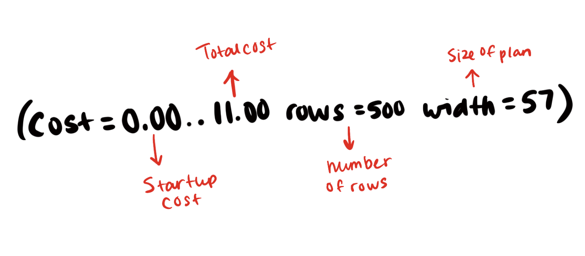

# [Profiling Queries with Explain Analyze](https://egghead.io/lessons/postgresql-profiling-queries-with-explain-analyze)

## Query Performance and Optimization

We check query performance by using the `explain` command.

```bash
explain select * from users;
```

This will return an execution plan which is generated by Postgres. For the command above, the execution plan will show how the table reference by statement will be scanned.

The most important thing to note is the `cost`.

### How `cost` Works

The `cost` output shows two different values that are seperated by 2 dots --> **startup cost**..**total cost**

**Startup cost**: The time it takes for the first row to be returned.
**Total cost**: The time it will take for all of the rows from our query to be returned.

Here's a little visual to make this easier to visualize :)



## Using Different Formats for `explain` Output

We can view the same output in different formats like JSON, YAML, XML etc. We do this by typing the following:

```bash
explain (format json) select form Users;
```

If you want to see this in another format, just replace `json` with your desired format.

## How `verbose` with `explain`

We can get even more output and information from `explain` by using the `verbose` option.

Using `verbose` will show us what **schema** the table exist on and the columns in the table.

## `explain` By Itself is Basically a Simulator

One of the most important things to remember about `explain` is that when we call it, we don't actually run our query. It acts more like a simulator. Really, the planner just shows estimates aka guesses.

So running `explain update users set email = null` doesn't actually update the `users` table.

### For Real `explain` Output

If we want the actually want 100% accurate output, run `explain` with `analyze`.

```bash
explain analyze update users set email = null;
```

Just remember, **running `explain analyze` will actually run your query**.

## Different Types of Scans

When we run `explain select * from users;`, the `select` initiates a **sequential scan**. So the select statment loops over every single row until the end of the table.

The **index scan** is faster. Running this kind of command:

```postgres
explain select * from users where user_handle = `a0eebc99-9c0b-4ef8-bb6d-6bb9bd380a11`;
```

Although index scan can be faster, it's startup cost can be longer than sequential scan in some cases.

### The `cost` of Using Options

In the example above, the `where` option was used. It's important to remember for options like `where` and `join` will end up affecting the `cost`.

## When to Use Which Option

It can be hard to determine which options will have the most optimal results with `cost`. But each table is different. To find the best, most optimal options, you'll have to run them through a profiler.
